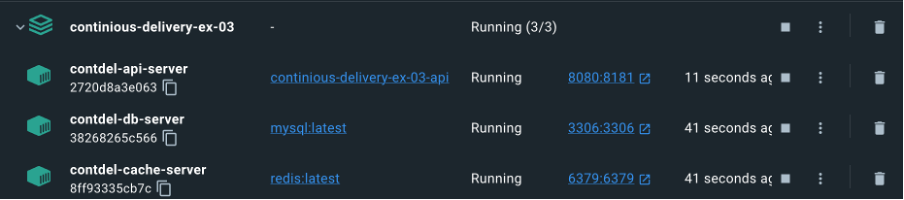
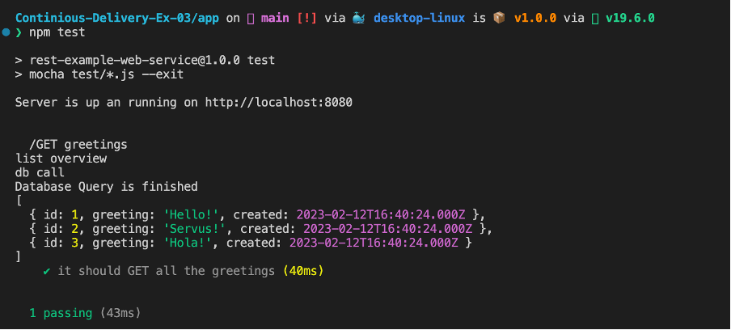
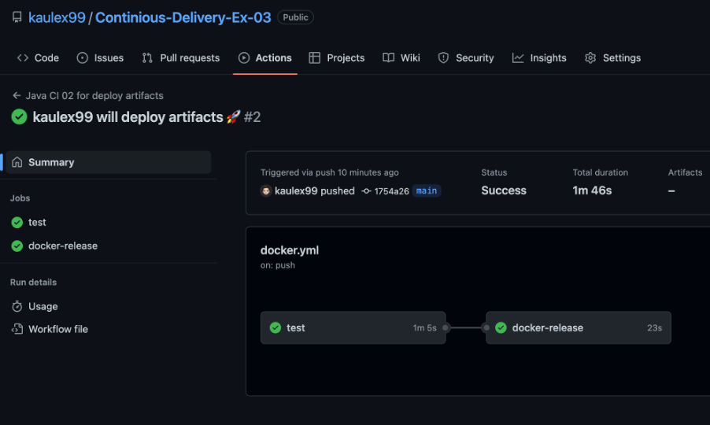
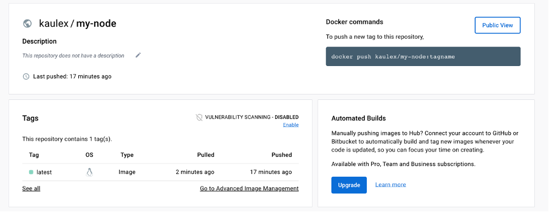
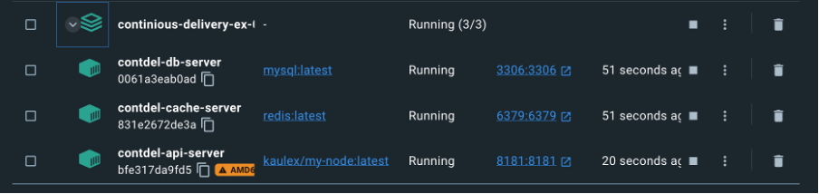

# Exercise 3
## Part 1
Done

## Part 2
Fixed docker-compose and started the containers. Commands:
```bash
docker compose build
docker compose up -d
```



The problem was that the port is already used by the docker container, so I just exposed the docker container on 8181 instead of 8080.



## Part 3

Now we can adapt the docker compose file to pull from the repository instead of building in directly.

See [Dockerhub](https://hub.docker.com/repository/docker/kaulex/my-node/general)




Docker compose for developers: (docker-compose.yml)
```yml
version: '3.8'

services:
  database-server:
    # using .env file to configure e.g. version number or other currently static variables
    image: mysql:latest
    container_name: contdel-db-server
    restart: always
    # setting environment variables is possible within docker-compose.yml
    environment:
      MYSQL_DATABASE: 'contdel'
      # So you don't have to use root, but you can if you like
      MYSQL_USER: 'fhj'
      # You can use whatever password you like
      MYSQL_PASSWORD: 'password'
      # Password for root access
      MYSQL_ROOT_PASSWORD: 'password'
    ports:
      - '3306:3306'
    # Where our data will be persisted
    volumes:      
      - ./mysql-data:/var/lib/mysql
      - ./mysql-init-files:/docker-entrypoint-initdb.d
    # check for status for depends_on conditions for api container start = service_healthy
    # otherwise no connection is possible at startup, alternative will be to refactor node implementation
    healthcheck:
        test: ["CMD", "mysqladmin" ,"ping", "-h", "localhost"]
        timeout: 20s
        retries: 10
        start_period: 20s # Estimated time to boot.

  # using redis for caching server, therefor we will use existing image
  # currently we not need any special configuration, so the docker-compose configuration is simple
  cache-server:
    image: redis:latest
    container_name: contdel-cache-server
    ports:
      - '6379:6379'
    restart: always

  # at last we build our own image by using Dockerfile in Sub-Directory
  api:
    container_name: contdel-api-server
    build: ./app
    # container will be started after dependencies are fulfilled
    depends_on:
      cache-server:
        condition: service_started
      database-server:
        condition: service_healthy
    ports:
      - "8181:8181"
    environment:
      SERVER_PORT: 8181
      DB_SERVER: database-server
      CACHE_SERVER: cache-server
```

For testers we replace the container build with the image:
```yml
  api:
    image: kaulex/my-node:latest
```

And start it with following command:
```bash
docker compose -f docker-compose.tester.yml up -d
```


